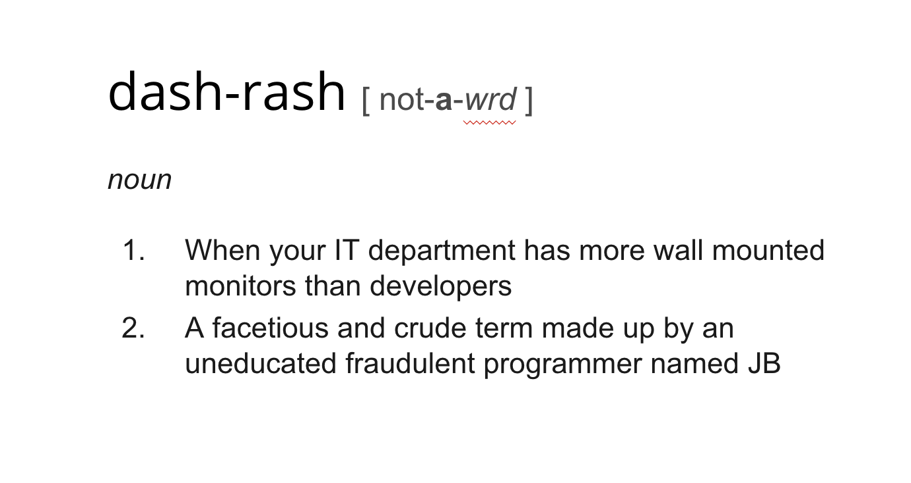

###My software fails! …and so does yours!

In my experience working with efective empowered agile software teams practicing healthy cultures and processes we were always still far away from dealing with outages elegantly. It wasn't until a few of our systems, through successful business manoeuvres were elevated to increasing levels of criticality that we began to put more thought into monitoring, observability and outage planning into our day to day.

We practiced BDD heavily, TDD religiously and agile ceremony...ceremoniously (suspend judgement of the value of those statements, I wouldnt suggest that these are a prescription for success but they did work well for us at the time). But we often fell into the trap for coding towards success, consequentilly, outages often broadsided us with embarresing unpredictibility.

Just like the tools, practices, culture and processes that makes CI and CD work, continuous visibility (CV) is where we weaponise our understanding of testing, observability and monitoring by including it into our day to day development process. Themes such as coding for failure, chaos engineering, testing in production, SRE and many many more are employed as required to build a "team first" approach to reliable systems. The culture is the power here, not the tools or processes. The systems I have worked on, as a consequence of extreme distribution have bred daunting exponetial routes of failure which rules out the ability to script tests covering all possible failure modes in a pre-production environment. This leads to an uncomfortable truth, we may just have to live with failure, how can we integrate with failure and force it to cohabit with success, in production! 

Accepting failure into production does create uncomfortable design preassure back down through your entire development team. "Buy in" is crucial to this mindshift and the successful improvement to system reliability.

####One of the tools we utilised to help us was dashboards.

We were already recording a wealth of insights about our systems such as timings, logs, tracing and hardware profiles to centralized stores and we started to mount overhead monitors in our office to present various collections of this data to the development teams. It is a simple and effective boost to visibility...and also makes the office look all modern and techy. But as with everything, if you build it, they may not come. No silver bullets in this world and often left neglected the value of our dashboards degraded.

The lightning talk I delivered at muCon 2019 focuses on how we can keep value in our overhead dashboards as well as my own teams journey on gaining visibility in a critical new system we were challenged to build.

### muCon Conference, London, 2019

There was an interesting question from the audience after this talk which wasn't captured in the video (partly down to me trying to evade questions :stuck_out_tongue:). The question was:

*"Can you talk about some of the tools you used for aiding visibility in your team"*

This question actually caught me by surprise, and whilst the they were absolutely correct and maybe I should have spoken about some of the tools we used such as **nagios, CheckMK, OPSGenie, graylog, graphite, grafana**. It struck me that the successful visibility we had on this project was absolutely not down to the tools we used but much more about the culture of visibility we adopted and the mindset we had. Embracing outages was more important than embracing tools. However, I'm not sure we would have been able to do it without the tools listed above.

Just like tools, dashboards don't bring visibility alone, they are just another way to empower the culture that breeds visibility.

